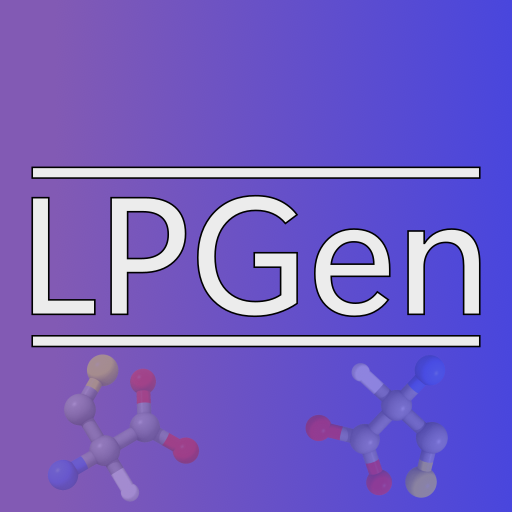

# LigParGen-GUI

  

##  [Quick Installation](https://github.com/urban233/LigParGenGUI/wiki/Installation-for-Windows-Operating-System)

## Contents of this document
* [Description](#Description)
* [Contents of this repository](#Contents-of-this-repository)
    * [Sources](#Sources)
    * [Documentation](#Documentation)
    * [Assets](#Assets)
* [Installation](#Installation)
    * [Windows](#Windows)
        * [Installation for Windows OS](#installation-for-windows-os)
        * [Offline environment](#offline-environment)
        * [Online installation (For experts)](#online-installation-for-experts)
    * [Source code](#Source-code)
* [Dependencies](#Dependencies)
* [Architecture](#Architecture)
* [Use cases](#Use-cases)
* [Citation](#Citation)
* [References and useful links](#References-and-useful-links)
* [Acknowledgements](#Acknowledgements)

## Description
LigParGen-GUI is an open software project that builds upon the software [LigParGen v2.1]() 
by providing a graphical user interface for easy use on a local computer.
This software aims to make running LigParGen more accessible for the scientific end-user.

## Contents of this repository
### Sources
The ["ligpargen_gui"]() subfolder contains all source code including Python modules, Qt .ui files and cascading stylesheets.

### Documentation
The <a href="https://github.com/urban233/LigParGenGUI/tree/main/docs">"docs"</a> folder
contains the end-user documentation in the form of markdown and HTML files.
The subfolder <a href="https://github.com/urban233/LigParGenGUI/tree/main/docs/dev-notes">"dev-notes"</a>, contains development notes.

### Assets
The <a href="https://github.com/urban233/LigParGenGUI/tree/main/assets">"assets"</a> folder consists of
the subfolder <a href="https://github.com/urban233/LigParGenGUI/tree/main/assets/images">"images"</a> which contains the LigParGenGUI logo.
If you are using LigParGenGUI for your own projects, you are welcome to give credit to LigParGenGUI by using the logo in your presentations, etc.

## Installation
LigParGenGUI is tested and available for Windows 10 and 11.
### Windows
For a convenient and user-friendly installation, the <a href="https://github.com/urban233/ComponentInstaller">"LigParGenGUI Component Installer"</a> is available.

**Important:**
* WSL2 **cannot** be uninstalled, once it is installed! Windows will integrate the WSL2 as a system component.
* Be aware that the computer needs to be **restarted** after installing WSL2.

#### Installation for Windows OS
A step-by-step guide can be found in the Wiki (click [here](https://github.com/urban233/LigParGenGUI/wiki/Installation-for-Windows-Operating-System) to go to the guide).

### Source code
This is a Python project based on a virtual environment.
To modify the source code, download or clone the repository
and open it in an IDE that supports virtual environments (e.g. PyCharm).
Finally, run `pip install -r requirements.txt` to set up the virtual environment used for development.

The project supports using a setup.py file to create a package that works with the LigParGenGUI Component Installer.
To build the inno setup EXE run: `run_automation.bat build-setup-exe`.

## Dependencies
**Needs to be installed yourself if prompted**
* BOSS
  * Download the BOSS software from the official William L. Jorgensen lab website: http://zarbi.chem.yale.edu/software.html
**Managed by LigParGenGUI:**
* Windows Subsystem for Linux 2
    * WSL2
    * License: Microsoft Software License Terms
* LigParGen
    * [LigParGen v2.1](https://github.com/Isra3l/ligpargen)
    * License: MIT License
* [PyQt6](https://riverbankcomputing.com/software/pyqt/intro)
    * License: GNU General Public License (GPL)

## Citation
You can cite this software or this repository as it is defined in the CITATION.cff file.

## References and useful links
**LigParGen**
* [LigParGen v2.1 GitHub repository](https://github.com/Isra3l/ligpargen)
* [LigParGen Web Server](https://traken.chem.yale.edu/ligpargen/)
* [Dodda, L., Cabeza de Vaca, I., Tirado-Rives, J., Jorgensen, W. LigParGen web server: an automatic OPLS-AA parameter generator for organic ligands. Nucleic Acids Research 45, 331–336 (2017). https://doi.org/10.1038/s41592-022-01488-1](https://doi.org/10.1093/nar/gkx312)

## Acknowledgements
**Developers:**
* Martin Urban
* Hannah Kullik

**End-user testers**
* Mirko Daniel
* Achim Zielesny

**Logo:**
* Martin Urban
* Hannah Kullik

**Initialization, conceptualization, and supervision:**
* Mirko Daniel and Achim Zielesny

**The LigParGenGUI project team would like to thank
the communities behind the open software libraries for their amazing work.**

<!--
**LigParGenGUI was developed at:**
 
 Zielesny Research Group
 Westphalian University of Applied Sciences
 August-Schmidt-Ring 10
 D-45665 Recklinghausen Germany
--!>

